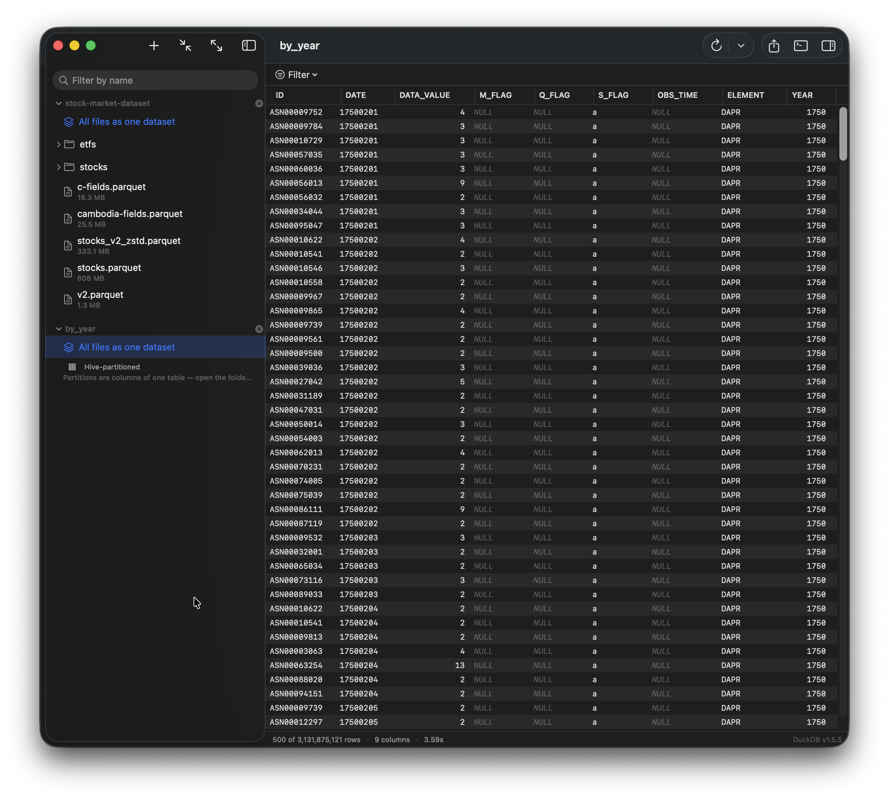

# DuckParq

[](https://github.com/xevix/duckparq/actions/workflows/ci.yml)

A native macOS parquet viewer for glancing at files quickly: point it at a
folder, click through parquet files in the sidebar, see rows immediately. Sort,
filter, or drop into SQL when you need to. DuckDB does the querying.

This project is not affiliated in any way with DuckDB, DuckLabs etc. It is an independent project.



## Build and run

```bash
make run
```

You need **macOS 15 or later on Apple silicon** and a **Swift 6 toolchain**.
Xcode is not required — Command Line Tools are enough (`xcode-select
--install`)

## Opening a single file

Three ways in, all doing the same thing:

- **File ▸ Open File…** (⌥⌘O).
- **Drag a file onto the window.** Anywhere in it — the whole window is the
  target. Drag a *folder* instead and it joins the sidebar, exactly as **Add
  Folder…** puts it there. Anything else is ignored.
- **Open it from Finder**, once the app is installed:

```bash
make install
```

That puts the app in `/Applications` and registers it as a handler for
`.parquet`, `.pq` and `.parq`, so Finder lists DuckParq under *Open With*,
offers it in *Get Info ▸ Open with*, and accepts a file dropped on its Dock
icon.

However it arrives, the file opens in the grid; where its row appears depends
on whether the sidebar can already reach it:

- **Inside a folder you added** — the folders down to it are expanded and the
  sidebar scrolls to the file, however deep it is.
- **Anywhere else** — it goes to **Recently Opened** at the top of the sidebar,
  and its folder is *not* added. Opening one file should not drag a Downloads
  directory into the sidebar. Right-click the row for **Add Containing
  Folder**, which moves it into the tree, or **Reveal in Finder**.

DuckParq does not take the association away from whatever already holds it.
To make it the one Finder uses on a double-click, set it in *Get Info ▸ Open
with* and press **Change All…**

## License

DuckParq is [MIT licensed](LICENSE).

The app statically links DuckDB, which is MIT licensed as well.
